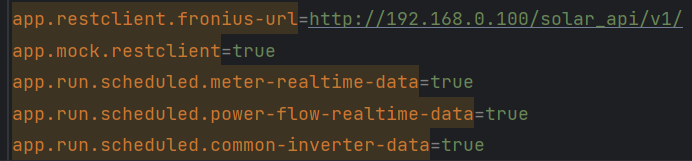

Brief Description:

PV monitoring for Fronius Solar API (JSON) V1 for hybrid systems. Real-time data collection and visualization of inverter, smart meter, and energy storage. Implemented with Java, Angular, and PostgreSQL. The application can optionally be operated with mock data.

Technologies:

    - Java 19
    - Maven 3.8.6
    - Spring 3.2.3
    - Angular 15, Angular Material Component Library, Charts: swimmlane ngx-charts
    - PostgreSQL 

Database:

    Recommand to run in docker-container
    - Run Docker command: docker compose up -d
    - Docker file: root/docker-compose.yml

    Crate new database "fronius_db"
    No test data is required, the tables are created automatically

Starting the Backend:

    Configuration in src/main/resources/application.properties:
        - Enter the inverter's IP address.
        - Choose between real-time operation and mock operation.
        - Select the data collections.

    Set the API query interval:
        - Changes for each data collection in src/main/java/scheduled.
        - Default setting: 15 seconds, with a 5-second offset for each datacollection.

    Before Starting:
        - Run: mvn clean install

    Start class: src/main/java/application/StartSpring.java

Starting the Frontend:

    Navigate to the "frontend" folder
        - Run: npm install
        - Run: npm start
